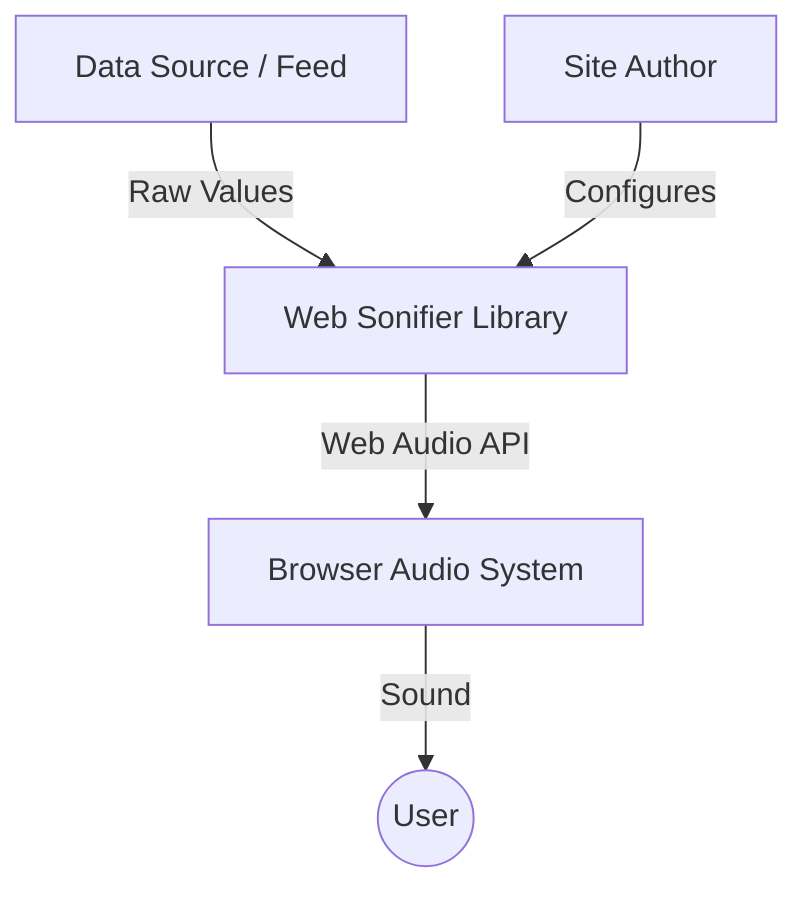
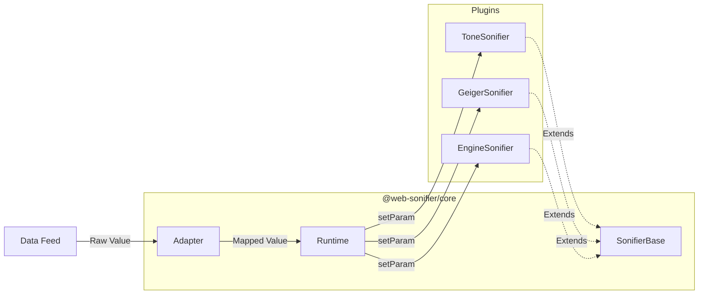

# Web Sonifier

[**Listen to the live demo**](https://web-sonifier.com)

A browser-native sonification framework that makes it easy to turn data streams into sound.

---

## High Level Overview

Web Sonifier is designed for site authors who need to monitor data visually and aurally, and for plugin authors who want to build high-quality audio synthesis tools.

### System Context
How the library fits into your stack:



### Internal Architecture
The relationship between the core modules:



---

## Installation & Usage

Web Sonifier is published as scoped packages on NPM under `@web-sonifier/core` and individual plugin packages (e.g. `@web-sonifier/tone`, `@web-sonifier/geiger`, `@web-sonifier/liquid`).

### 1. From NPM (Vite, Vue, React, Svelte, etc.)
Ideal for modern framework projects utilizing standard package managers:

```bash
npm install @web-sonifier/core @web-sonifier/tone
```

Import and use standard ES imports directly in your JavaScript or framework components:
```js
import { Runtime, Adapter } from '@web-sonifier/core'
import { ToneSonifier } from '@web-sonifier/tone'

const runtime = new Runtime()
runtime.register('tone', ToneSonifier)
await runtime.start()
```

### 2. From CDN (Vanilla Browser HTML/JS)
You can use Web Sonifier directly in your browser without any bundlers or build steps using public NPM mirrors like **unpkg** or **jsDelivr**.

#### Method A: Using Global Script Tags (IIFE)
Import the pre-packaged self-contained scripts. The libraries will automatically expose themselves on global namespaces (`window.WebSonifier`, `window.ToneSonifier`, etc.):

```html
<!-- Load Core -->
<script src="https://unpkg.com/@web-sonifier/core"></script>
<!-- Load Tone Plugin -->
<script src="https://unpkg.com/@web-sonifier/tone"></script>

<script>
  // Access via global variables
  const runtime = new WebSonifier.Runtime();
  runtime.register('tone', ToneSonifier.ToneSonifier);
  
  runtime.start().then(() => {
    const toneInstance = runtime.create('tone');
  });
</script>
```

#### Method B: Using Browser ES Modules (ESM)
Load standard modern ES modules directly using standard browser import statements:

```html
<script type="module">
  import { Runtime, Adapter } from 'https://cdn.jsdelivr.net/npm/@web-sonifier/core/dist/index.js';
  import { ToneSonifier } from 'https://cdn.jsdelivr.net/npm/@web-sonifier/tone/dist/ToneSonifier.js';

  const runtime = new Runtime();
  runtime.register('tone', ToneSonifier);
  await runtime.start();
</script>
```

---

## Documentation

-  [**Core Concepts**](./docs/core-concepts.md) — The mental model and architectural overview.
-  [**Site Author Guide**](./docs/site-author-guide.md) — How to use the library in your project.
-  [**Plugin Author Guide**](./docs/plugin-author-guide.md) — How to build your own sonifiers.
-  [**API Reference**](./docs/api-reference.md) — Detailed class and method documentation.
-  [**Project Meta**](./docs/project-meta.md) — Design decisions, roadmap, and structure.

---

## Quick Start (Demo)

The repository includes a vanilla JS demo in the `demo/` folder.

1. Clone the repo.
2. Serve the `demo/` folder (e.g., `npx serve demo`).
3. Open in your browser.

**Deploying to Firebase:**
1. `npm install -g firebase-tools`
2. `firebase login`
3. `firebase deploy --only hosting`

You can listen to the demo [here](https://web-sonifier.com)
---

## Contributing

We use TDD and a monorepo structure. Ensure you run `npm test` before submitting changes.

- **Core Mandates:** See [GEMINI.md](./GEMINI.md) for architectural constraints and best practices.
- **License:** ISC
