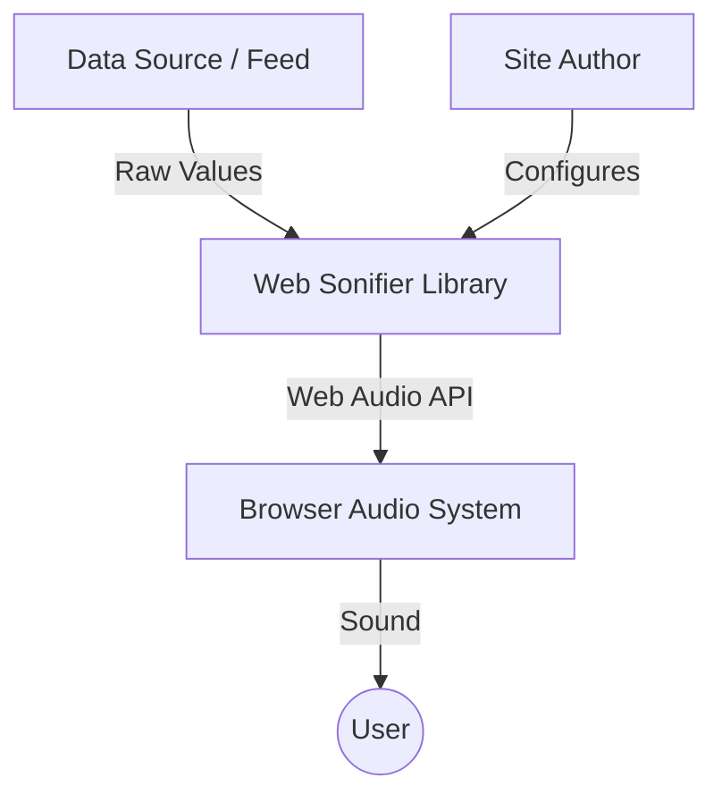
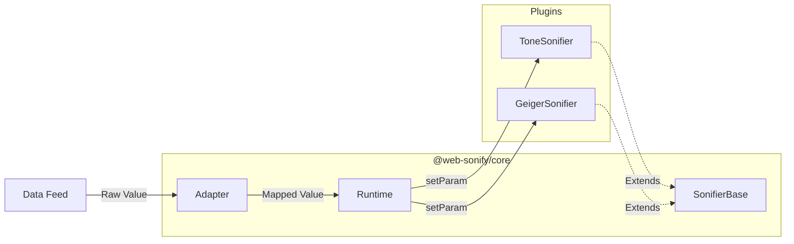

# Web Sonifier

[**Listen to the live demo**](https://web-sonifier.web.app)

A browser-native sonification framework that makes it easy to turn data streams into sound.

---

## High Level Overview

Web Sonifier is designed for site authors who need to monitor data visually and aurally, and for plugin authors who want to build high-quality audio synthesis tools.

### System Context
How the library fits into your stack:

### Internal Architecture
The relationship between the core modules:

---

## Documentation

- 🧠 [**Core Concepts**](./docs/core-concepts.md) — The mental model and architectural overview.
- 🚀 [**Site Author Guide**](./docs/site-author-guide.md) — How to use the library in your project.
- 🔌 [**Plugin Author Guide**](./docs/plugin-author-guide.md) — How to build your own sonifiers.
- 📖 [**API Reference**](./docs/api-reference.md) — Detailed class and method documentation.
- 🏗️ [**Project Meta**](./docs/project-meta.md) — Design decisions, roadmap, and structure.

---

## Quick Start (Demo)

The repository includes a vanilla JS demo in the `demo/` folder.

1. Clone the repo.
2. Serve the `demo/` folder (e.g., `npx serve demo`).
3. Open in your browser.

**Deploying to Firebase:**
1. `npm install -g firebase-tools`
2. `firebase login`
3. `firebase deploy --only hosting`

---

## Contributing

We use TDD and a monorepo structure. Ensure you run `npm test` before submitting changes.

- **Core Mandates:** See [GEMINI.md](./GEMINI.md) for architectural constraints and best practices.
- **License:** ISC
