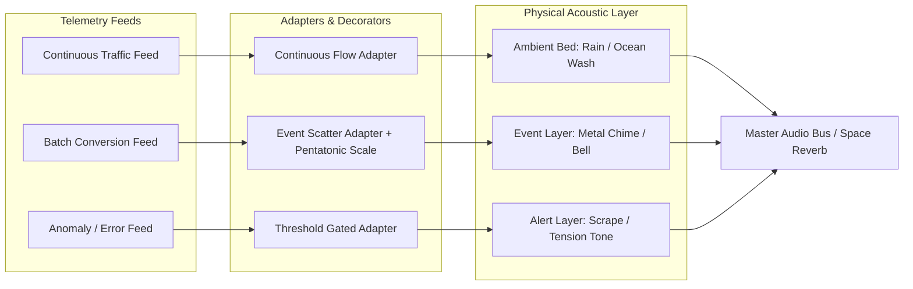

# Procedural Audio & Event Sonification Architecture

*Living reference document for physics-based procedural audio, event vs. state sonification, adapter pipelines, and composition in Web Sonifier.*

---

## 1. High-Level Vision & Objectives

Traditional sonification maps data metrics ($X, Y$) directly to synthetic sound attributes (oscillator pitch, filter cutoff). While simple, this approach causes rapid **auditory fatigue** and lacks physical intuition.

Inspired by **Andy Farnell’s *Designing Sound*** (MIT Press), our vision is:
1. **Procedural Physics Models**: Synthesize sound from physical mechanics, fluid dynamics, aerodynamics, and materials (e.g. Minnaert bubble cavity resonance, Euler-Bernoulli chime rods, stick-slip friction, Aeolian vortex shedding).
2. **Dual Temporal Paradigm**: Seamlessly support both **continuous state monitoring** (weather/stream/drones) and **discrete event notification** (telemetry arrivals, transactions, conversions, anomalies).
3. **Composable Transformation Pipelines**: Separate data ingestion from temporal shaping (de-quantizing, time scattering) and musical/aesthetic mapping (scale snapping, harmonic series, microtonality).
4. **Independent Building Blocks**: Ensure procedural audio models exist as pure, standalone Web Audio classes that can be used outside `web-sonifier`, while wrapping them as `SonifierBase` plugins.

---

## 2. Event vs. State Sonification

| Attribute | Continuous State Sonification | Discrete Event Sonification |
| :--- | :--- | :--- |
| **Data Nature** | Ongoing level, gauge, pressure (e.g. active users, CPU load, memory) | Point-in-time occurrence (e.g. signup, transaction, 500 error) |
| **SC Analogy** | `Pmono`, continuous `In.kr` modulation | `Pbind`, `Trig1`, `\type, \note` |
| **Acoustic Behavior** | Drone, engine hum, ocean wash, continuous bubble stream | Single droplet, bell chime strike, wood click, alert |
| **Acoustic Lifecycle** | Runs continuously; parameters smoothly glide | Instantaneous excitation followed by natural physical ring-down |
| **Polled Batch Feeds** | Reads current value on each poll | Receives count $\Delta$ over window; requires **temporal de-quantization** |

---

## 3. The 3-Tier Pipeline: Adapters, Transformers & Sonifiers

```mermaid
graph TD
    Data[Data Feed / API / Poller] -->|Raw Values or Event Batches| TempShaper[1. Temporal Shaper / Scheduler]
    TempShaper -->|Timed Triggers / Events| ValueMapper[2. Transfer Function / Scaling]
    ValueMapper -->|Continuous Floats| Quantizer[3. Decorator / Quantizer]
    Quantizer -->|Target Audio Parameters or Strike Events| Sonifier[4. Sonifier / Physical Model]

    subgraph "Temporal Shaping Layer"
        TempShaper --> ContinuousPass[Immediate / Pass-through]
        TempShaper --> Scatter[Windowed Scatter / De-quantizer]
        TempShaper --> Grid[Rhythmic Quantization / Beat Clock]
    end

    subgraph "Musical / Quantizer Decorators"
        Quantizer --> Micro[Microtonal / Physics Linear-Exp]
        Quantizer --> Scale[Scale / Mode Snapper (Pentatonic, Dorian)]
        Quantizer --> Harmonics[Harmonic Series Multiples (f0, 2f0, 3f0)]
        Quantizer --> Bins[Discrete Step Buckets]
    end
```

### The Windowed Scatter Pattern (De-quantization)
When analytics or telemetry feeds arrive infrequently (e.g. once every 60 seconds) with a batch count (e.g. $N = 5$ email signups):
- Firing all $N$ at $T=0$ sounds like an unnatural machine-gun burst.
- Holding the state at 5 for 60 seconds misrepresents an instantaneous event.
- **Solution**: The `EventScatterAdapter` receives $(N, \text{window}=60s)$ and distributes $N$ strike triggers randomly or via a Poisson process across the upcoming 60-second window. This reconstructs the authentic feeling of traffic happening in real time.

---

## 4. Multi-Sonifier Soundscapes & Composition

Rather than building single massive sonifiers, rich sound environments are composed of complementary, coordinated acoustic layers:



---

## 5. Physical Modeling Catalog

### A. Fluid Cavity: The Minnaert Bubble (Chapter 34)
- **Status**: Implemented (`packages/bubble/`).
- **Physics**: Air cavity pulsation in water.
  $$f_0 \approx \frac{1}{2\pi r} \sqrt{\frac{3\gamma P}{\rho}} \approx \frac{3.26}{r} \text{ Hz}$$
- **Acoustics**: Rapid upward frequency chirp $f(t) = f_0(1 + \alpha t)$ from neck detachment and surface tension release, with viscous exponential damping $\exp(-\eta t)$.

### B. Inharmonic Solid Rods: Metal Chimes & Crotales
- **Status**: In progress (`packages/chime/`).
- **Physics**: Euler-Bernoulli transverse vibrations of a free-free or clamped-free cylindrical metal tube.
  - Mode 1: $1.00 \cdot f_0$
  - Mode 2: $2.76 \cdot f_0$
  - Mode 3: $5.40 \cdot f_0$
  - Mode 4: $8.93 \cdot f_0$
- **Acoustics**: Metallic shimmer caused by non-integer overtones. High modes decay quickly (100–300ms) while the fundamental sustains for 2–4 seconds.

### C. Future Procedural Candidates
1. **Aerodynamics / Wind**: Vortex shedding / Strouhal flow ($f = \text{St} \cdot v / d$) over resonant cavities.
2. **Friction / Stick-Slip**: Micro-asperity impacts and thermal crackle (brakes, chalk, dragging).
3. **Mechanical Escapement**: Clockwork ticks, gears, motors.

---

## 6. Git & Branching Strategy

To manage parallel development across multiple feature tracks (e.g. `MMM-Lab`, `MetaParameters`, `Designing Sound`):
- **Short-Lived Feature Branches**: `feat/<feature-name>` branched directly off `main`.
- **Merge Back to Main Early & Often**: As soon as a feature branch passes unit tests and verification, merge back into `main` and delete the feature branch.
- **Regular Pull / Rebase**: Active branches should pull or rebase on `main` before starting new commits to avoid divergent drift.
- **Pre-commit Gate**: Full test suite runs automatically via Husky before every commit.

---

## 7. Implementation Changelog & Artifacts

### A. Modal Wind Chime (`packages/chime/`)
- **Physics**: Transverse cylindrical bar vibrations via Euler-Bernoulli modes ($1.000, 2.756, 5.404, 8.933$).
- **Exciter**: 6ms soft rubber/wood clapper contact buffer + mode-dependent damping ($Q$).
- **Features**:
  - `ModalChime.strike({ pitch, velocity, damping, pan })`: discrete strike API.
  - `ModalChime.setWindSpeed(kmh)`: continuous ambient airflow driving stochastic clapper strikes across pentatonic tubes.
  - Alloys: `aluminum` (singing & long sustain), `bronze` (warm & heavy), `steel` (bright & cutting).
- **Demo**: `packages/chime/demo/index.html`.

### B. Musical Quantizer Decorators (`packages/core/src/Quantizer.js`)
- `Quantize.scale(scaleDegrees, { rootFreq })`: Snaps continuous frequency to musical scales (`pentatonic`, `minorPentatonic`, `dorian`, `hirajoshi`, `wholeTone`, `major`, `minor`).
- `Quantize.harmonics(f0)`: Snaps to integer multiples of fundamental $f_0$.
- `Quantize.steps(stepSize)`: Discrete bucket quantization.
- `adapter.pipe(...transformers)`: Fluent pipelining on `Adapter`.

### C. Temporal De-quantizer (`packages/core/src/EventScatterAdapter.js`)
- De-quantizes periodic or infrequent polled batch telemetry (e.g. $N$ signups over 60s).
- Spreads $N$ strike triggers across the upcoming window via `random`, `uniform`, or `poisson` strategies.
