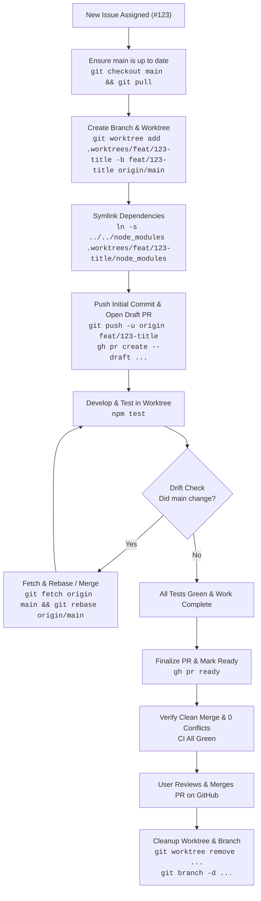

# Issue-Driven Worktree & Pull Request Workflow

This document details the standardized developer and agent workflow for contributing to the **Web Sonifier** codebase using **Git Worktrees** and **GitHub Draft Pull Requests**.

---

## Why Git Worktrees?

In a multi-package audio framework monorepo, context-switching between branches on a single working directory causes:
1. Audio state corruption and uncommitted UI test artifacts.
2. Invalidation of cached modules or file watchers.
3. Risky `git stash` operations.

**Git Worktrees** allow multiple branches to be checked out simultaneously into separate directory trees that share the exact same `.git` repository storage, commit history, and remotes.

---

## Workflow Diagram



---

## Step-by-Step Instructions

### 1. Provision the Branch & Worktree

Always start from a fresh `main`:
```bash
git checkout main
git pull origin main
```

Create a new worktree in the `.worktrees/` directory (which is ignored by Git in `.gitignore`):
```bash
# Syntax: git worktree add .worktrees/<branch-name> -b <branch-name> origin/main
git worktree add .worktrees/feat/123-stereo-panner -b feat/123-stereo-panner origin/main
```

Symlink the monorepo root's `node_modules` into the worktree:
```bash
ln -s ../../node_modules .worktrees/feat/123-stereo-panner/node_modules
```

> [!TIP]
> Symlinking `node_modules` takes less than 10 milliseconds and shares the root dependencies across all active worktrees without re-running `npm install`.

---

### 2. Push & Create a GitHub Draft Pull Request

Immediately push the branch and open a **Draft Pull Request**:
```bash
cd .worktrees/feat/123-stereo-panner

# If you don't have code changes yet, you can create a placeholder commit:
git commit --allow-empty -m "chore: scaffold work for #123"
git push -u origin feat/123-stereo-panner

# Open draft PR via GitHub CLI
gh pr create --draft \
  --title "WIP: #123 Stereo Panner Modulation" \
  --body "Closes #123

Work in progress on dedicated worktree (\`.worktrees/feat/123-stereo-panner\`).

### Scope
- Add stereo panning modulation support
- Connect audio parameters to Adapter"
```

#### Why a Draft PR immediately?
- **Tracks Drift**: GitHub will visually display whether the branch is up to date or behind `main`.
- **Early CI Checks**: Tests run on GitHub Actions (`test.yml`) as commits are pushed.
- **Transparency**: Collaborators can see active work in flight before requesting a formal code review.

---

### 3. Develop & Keep Synchronized

All edits, builds, and test executions must occur within the worktree directory:
```bash
# Inside .worktrees/feat/123-stereo-panner/
npm test
```

Periodically check if `main` has progressed:
```bash
git fetch origin main
# Rebase or merge to incorporate changes from main
git rebase origin/main
```
If merge conflicts occur, resolve them immediately while context is fresh.

---

### 4. Finalize the Pull Request

When all tasks, test cases, and documentation are complete:

1. **Verify Unit Tests**:
   ```bash
   npm test
   ```
2. **Push Final Commits**:
   ```bash
   git push origin feat/123-stereo-panner
   ```
3. **Update PR Description**:
   Update the PR description using `gh pr edit` to include:
   - Full summary of changes.
   - Files modified.
   - Verification checklist.
4. **Mark PR Ready for Review**:
   ```bash
   gh pr ready
   ```
5. **Verify Clean Mergeability**:
   Ensure GitHub reports zero conflicts:
   ```bash
   gh pr view --json mergeable,mergeStateStatus
   ```

---

### 5. User Review & Merge

**The USER performs the final code review and merges the PR on GitHub.**

The developer / agent must guarantee that:
- All CI status checks are passing (100% green).
- There are no conflicts with `main`.
- The PR is in a clean, mergeable state.

---

### 6. Cleanup Worktree & Sync Main

Once the PR has been merged by the user on GitHub:

1. Switch back to the root repository:
   ```bash
   cd /Users/graha/Documents/web-sonifier
   git checkout main
   git pull origin main
   ```
2. Remove the worktree:
   ```bash
   git worktree remove .worktrees/feat/123-stereo-panner
   ```
3. Delete the local and remote branch:
   ```bash
   git branch -d feat/123-stereo-panner
   git push origin --delete feat/123-stereo-panner
   ```
4. Confirm clean status:
   ```bash
   git worktree list
   git status
   ```

---

## Quick Reference Cheatsheet

| Action | Command |
| :--- | :--- |
| **List Worktrees** | `git worktree list` |
| **Add Worktree** | `git worktree add .worktrees/<branch> -b <branch> origin/main` |
| **Symlink Modules** | `ln -s ../../node_modules .worktrees/<branch>/node_modules` |
| **Draft PR** | `gh pr create --draft --title "WIP: ..." --body "..."` |
| **Track Drift / Update** | `git fetch origin main && git rebase origin/main` |
| **Mark Ready** | `gh pr ready` |
| **Check Mergeability** | `gh pr view --json mergeable,statusCheckRollup` |
| **Remove Worktree** | `git worktree remove .worktrees/<branch>` |
| **Prune Worktrees** | `git worktree prune` |
